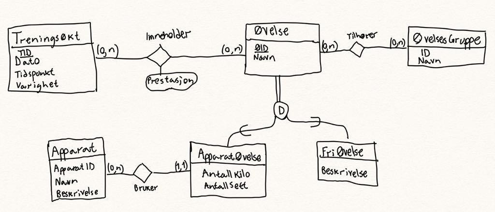
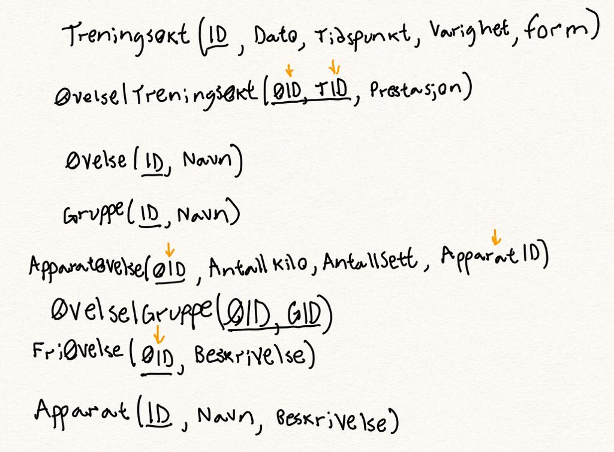

# Innlevering 1 - Konseptuell Datamodell

**Gruppe 70** - Magnus Ramm, Magnus Tidemann, Vy Thi My Nguyen, Adrian Leren

## ER-diagram



## RDB-diagram



## SQL

```sql
USE magnram_db;
CREATE TABLE Treningsøkt (
  TreningsøktID INT NOT NULL AUTO_INCREMENT,
  Datotid DATETIME,
  Varighet TIME,
  Form int,
  CONSTRAINT PRIMARY KEY (TreningsøktID)
);

CREATE TABLE Gruppe (
  GruppeID INT NOT NULL AUTO_INCREMENT,
  Navn VARCHAR(45),
  CONSTRAINT PRIMARY KEY (GruppeID)
);

CREATE TABLE Øvelse (
  ØvelseID INT NOT NULL AUTO_INCREMENT,
  Navn VARCHAR(45),
  CONSTRAINT PRIMARY KEY (ØvelseID)
);

CREATE TABLE ØvelseIGruppe (
  ØvelseID INT NOT NULL,
  GruppeID INT NOT NULL,
  CONSTRAINT PRIMARY KEY (ØvelseID, GruppeID),
  CONSTRAINT FOREIGN KEY (ØvelseID) REFERENCES Øvelse(ØvelseID),
  CONSTRAINT FOREIGN KEY (GruppeID) REFERENCES Gruppe(GruppeID)
);

CREATE TABLE ØvelseITreningsøkt (
  ØvelseID INT NOT NULL,
  TreningsøktID INT NOT NULL,
  Prestasjon INT,
  CONSTRAINT PRIMARY KEY (ØvelseID, TreningsøktID),
  CONSTRAINT FOREIGN KEY (ØvelseID) REFERENCES Øvelse(ØvelseID),
  CONSTRAINT FOREIGN KEY (TreningsøktID) REFERENCES Treningsøkt(TreningsøktID)
);

CREATE TABLE FriØvelse (
  ØvelseID INT NOT NULL,
  Beskrivelse VARCHAR(255),
  CONSTRAINT PRIMARY KEY (ØvelseID),
  CONSTRAINT FOREIGN KEY (ØvelseID) REFERENCES Øvelse(ØvelseID)
);

CREATE TABLE Apparat (
  ApparatID INT NOT NULL AUTO_INCREMENT,
  Navn VARCHAR(45),
  Beskrivelse VARCHAR(255),
  CONSTRAINT PRIMARY KEY(ApparatID)
);

CREATE TABLE ApparatØvelse (
  ØvelseID INT NOT NULL,
  AntallKilo INT,
  AntallSett INT,
  ApparatID INT NOT NULL,
  CONSTRAINT PRIMARY KEY (ØvelseID),
  CONSTRAINT FOREIGN KEY (ØvelseID) REFERENCES Øvelse(ØvelseID),
  CONSTRAINT FOREIGN KEY (ApparatID) REFERENCES Apparat(ApparatID)
);
```

## Beskrivelse

**Hvordan møter vår modell kravene til oppaven?**

### **Registrere apparater, øvelser og treningsøkter med tilhørende data**

Vi har definert tabeller for både *Apparat*, *Øvelse* og *Treningsøkt* der vi kan legge til rader med det de trenger av informasjon.

### **Få opp informasjon om et antall n sist gjennomførte treningsøkter med notater, der n spesifiseres av brukeren**

*Treningsøkt*-tabellen inneholder data for hver utførte treningsøkt for personen. Denne tabellen blir knyttet opp mot *Øvelse*-tabellen, og de blir loggført gjennom en tabell der de unike id-ene samsvarer. Ved å sortere tabellen etter dato for treningsøkten, og kun hente de n ønskede treningsøktene, oppfyller vi dette kravet.

### **For hver enkelt øvelse skal det være mulig å se en resultatlogg i et gitt tidsintervall spesifisert av brukeren**

Vi kan kombinere *Treningsøkt*-tabellen med den ønskede kolonnen i *Øvelse*-tabellen, og deretter velge ut tidsintervallet vi ønsker. Vi kan også kombinere flere tabeller slik at vi kan få ut informasjon om apparater og lignende i resultatloggen.

### **Lage øvelsegrupper og finne øvelser som er i samme gruppe**

Vi har definert en tabell for øvelsegrupper, *Gruppe*, og en koblingstabell for øvelsegrupper og øvelser, *ØvelseIGruppe*. Disse kan kombineres for å hente den ønskede informasjonen.

### *Valgfritt use case* - **Kunne hente ut informasjon om hvilke øvelser og apparater brukes oftest**

Ved å kombinere *Treningsøkt*-tabellen med *Øvelse*-tabellen, og deretter sortere etter antall forekomster av samme øvelse, kan vi finne hvilke øvelser som gjennomføres oftest. Dette kan også ekspanderes til finne brukerens favorittapparater ved å videre kombinere resultatet med *Apparat*-tabellen og sortere etter antall forekomster av samme apparat.
