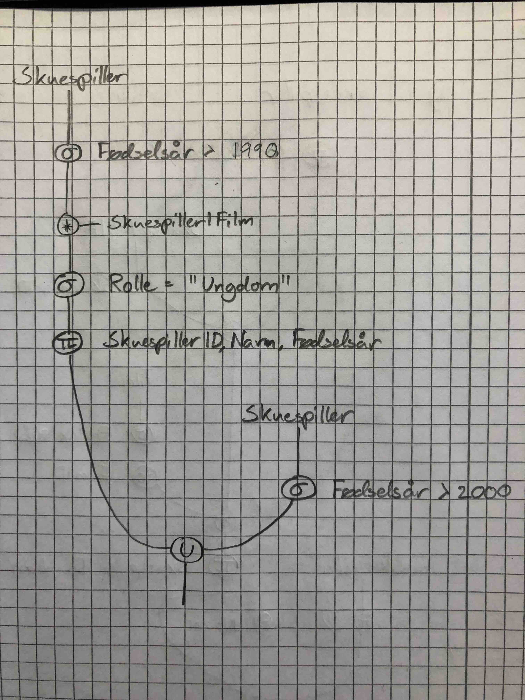
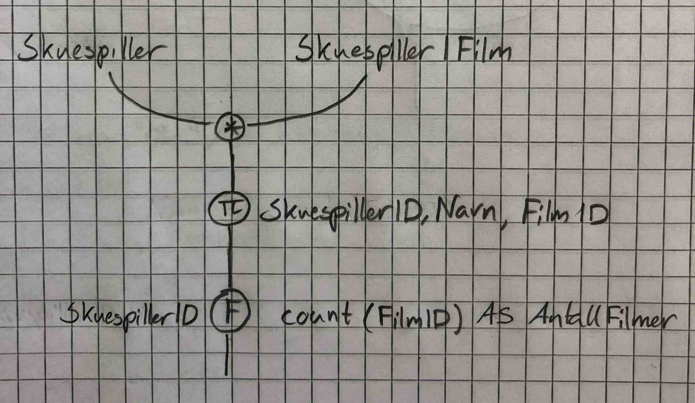

# Øving 3 - Adrian Leren

## Oppgave 1

### 1a)

På fremmednøkkel-restriksjonen, be om å slette data når referansen slettes.

```sql
ON DELETE CASCADE
```

### 1b)

```sql
CREATE TABLE `Regissør` (
  `RegissørID` INTEGER NOT NULL,
  `Navn` VARCHAR(40),
  PRIMARY KEY (`RegissørID`)
);
```

```sql
CREATE TABLE `Sjanger` (
  `SjangerID` INTEGER NOT NULL,
  `Navn` VARCHAR(40),
  `Beskrivelse` VARCHAR(1000),
  PRIMARY KEY (`SjangerID`)
);
```

```sql
CREATE TABLE `Skuespiller` (
  `SkuespillerID` INTEGER NOT NULL,
  `Navn` VARCHAR(40),
  `Fødselsår` INTEGER,
  PRIMARY KEY (`SkuespillerID`)
);
```

```sql
CREATE TABLE `Film` (
  `FilmID` INTEGER NOT NULL,
  `Tittel` VARCHAR(40),
  `Produksjonsår` INTEGER,
  `RegissørID` INTEGER,
  PRIMARY KEY (`FilmID`),
  FOREIGN KEY (`RegissørID`) REFERENCES `Regissør` (`RegissørID`) ON DELETE SET NULL ON UPDATE CASCADE
);
```

```sql
CREATE TABLE `SjangerForFilm` (
  `FilmID` INTEGER NOT NULL,
  `SjangerID` INTEGER NOT NULL,
  PRIMARY KEY (`FilmID`, `SjangerID`),
  FOREIGN KEY (`FilmID`) REFERENCES `Film` (`FilmID`) ON DELETE CASCADE ON UPDATE CASCADE,
  FOREIGN KEY (`SjangerID`) REFERENCES `Sjanger` (`SjangerID`) ON DELETE CASCADE ON UPDATE CASCADE
);
```

```sql
CREATE TABLE `SkuespillerIFilm` (
  `FilmID` INTEGER NOT NULL,
  `SkuespillerID` INTEGER NOT NULL,
  `Rolle` VARCHAR(40),
  PRIMARY KEY (`FilmID`, `SkuespillerID`),
  FOREIGN KEY (`FilmID`) REFERENCES `Film` (`FilmID`) ON DELETE CASCADE ON UPDATE CASCADE,
  FOREIGN KEY (`SkuespillerID`) REFERENCES `Skuespiller` (`SkuespillerID`) ON DELETE CASCADE ON UPDATE CASCADE
);
```

### 1c)

```sql
INSERT INTO `Regissør` (`RegissørID`, `Navn`) VALUES (1, "Peyton Reed");
INSERT INTO `Regissør` (`RegissørID`, `Navn`) VALUES (2, "Tom Shadyac");
INSERT INTO `Film` (`FilmID`, `Tittel`, `Produksjonsår`, `RegissørID`) VALUES (1, "Yes Man", 2008, 1);
INSERT INTO `Skuespiller` (`SkuespillerID`, `Navn`, `Fødselsår`) VALUES (1, "Jim Carey", 1962);
INSERT INTO `SkuespillerIFilm` (`FilmID`, `SkuespillerID`, `Rolle`) VALUES (1, 1, "Carl");
```

### 1d)

```sql
UPDATE `Skuespiller`
SET `Navn` = "James Eugene Carey"
WHERE `Navn` = "Jim Carey";
```

### 1e)

```sql
DELETE
FROM `Regissør`
WHERE `Navn` = "Tom Shadyac";
```

## Oppgave 2

### 2a)

```sql
SELECT *
FROM `Film`;
```

### 2b)

```sql
SELECT `Navn`
FROM `Skuespiller`
WHERE `Fødselsår` > 1960;
```

### 2c)

```sql
SELECT `Navn`
FROM `Skuespiller`
WHERE `Fødselsår` > 1979 AND `Fødselsår` < 1990
ORDER BY `Navn` ASC;
```

### 2d)

```sql
SELECT `Tittel`, `Rolle`
FROM `Skuespiller`
  NATURAL JOIN `SkuespillerIFilm`
  NATURAL JOIN `Film`
WHERE `Navn` = "Morgan Freeman";
```

### 2e)

```sql
SELECT DISTINCT `Tittel`
FROM `Skuespiller`
  NATURAL JOIN `SkuespillerIFilm`
  NATURAL JOIN `Film`
  NATURAL JOIN `Regissør`;
```

### 2f)

```sql
SELECT COUNT(*)
FROM `Skuespiller`
WHERE `Navn` LIKE "C%";
```

### 2g)

```sql
SELECT `Navn`, COUNT(*)
FROM `Sjanger`
  NATURAL JOIN `SjangerForFilm`
GROUP BY `Navn`;
```

### 2h)

```sql
SELECT `Navn`
FROM `Skuespiller`
WHERE `Navn` IN (
  SELECT `Navn`
  FROM `Skuespiller`
    NATURAL JOIN `SkuespillerIFilm`
    NATURAL JOIN `Film`
  WHERE `Tittel` = "Ace Ventura: Pet Detective"
) AND `Navn` NOT IN (
  SELECT `Navn`
    FROM `Skuespiller`
      NATURAL JOIN `SkuespillerIFilm`
      NATURAL JOIN `Film`
    WHERE `Tittel` = "Ace Ventura: When Nature Calls"
);
```

### 2i)

```sql
SELECT `Tittel`, `FilmID`, AVG(`Fødselsår`) AS `Snittår`
FROM `Film`
  NATURAL JOIN `SkuespillerIFilm`
  NATURAL JOIN `Skuespiller`
GROUP BY `FilmID`
HAVING `Snittår` > (
  SELECT AVG(`Fødselsår`)
  FROM `Skuespiller`
);
```

## Oppgave 3

### 3a)


### 3b)



### 3c)



## Oppgave 4

### 4a)

2 felter per person i tabellen må endres. Det gir 12 felter totalt i dette tilfellet.

### 4b)

Opprett en egen tabell for fakulteter, f.eks.:

* Fakultet( FakultetID (PK), Kode, Navn, Bygg )

Endre den første tabellen til å referere til fakultet-tabellen:

* Tabell( PersonID (PK), Navn, TelefonNr, FakultetID (FK) )

Nå trenger vi bare å oppdatere navn og kode i fakultet-tabellen, som er 2 felter.

## Oppgave 5

### 5a)

* (3, A -> C) stemmer ikke da det for like A finnes forskjellige C.
* (4, AB -> C) stemmer heller ikke av samme grunn som over. Like AB, men ulik C.
* (6, D -> C) stemmer ikke. Lik D, ulik C.
* (9, A er K) stemmer ikke da det finnes flere a1 og a3 i tabellen med ulike verdier i de andre kolonnene.

### 5b)

**R** = {A, B, C, D} og **F** = {A -> C, B -> D, ABC -> D}

* **A+** = AC
* **D+** = D
* **BC+** = BCD
* **AB+** = ABCD = **R**
