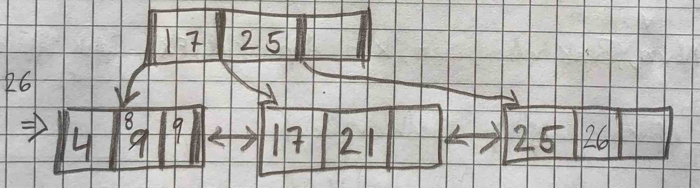

# Øving 4 - Adrian Leren

## Oppgave 1

$R = \left\{A, B, C, D\right\} \\ F = \left\{A \rightarrow D, C \rightarrow AB\right\}$

$\Rightarrow C^+ = ABCD$

### 1a)

Tabellen er på 2NF. Det finnes ingen ikke-nøkkel-attributter som er delvis avhengige av en kandidatnøkkel (ingen ikke-nøkler avhenger delvis av C).

### 1b)

Tabellen er **ikke** på 3NF. $A \rightarrow D$, men $A$ er ikke en supernøkkel $\wedge$ $A$ er ikke et nøkkelattributt.

### 1c)

Tabellen er **ikke** på BCNF. Da tabellen ikke er på 3NF kan den heller ikke være på BCNF.

### 1d)

**Attributtbevaring** - De nye tabellene kan lagre det samme. Alle attributter i tabellen må finnes i minst én av projeksjonene

**Bevaring av funksjonelle avhengigheter** - Projeksjonene beholder de samme restriksjonene som tabellen hadde i utgangspunktet.

**Tapsløs sammenstilling** - Det blir ikke introdusert falske/ugyldige data ved sammenslåing/joining av projeksjonene.

### 1e)

$R_1 = \left\{\underline{C}, A, B \right \} \\ R_2 = \left\{\underline{A}, D \right\}$

Her er både $R_1$ og $R_2$ på BCNF. For alle funksjonelle avhengigheter ($X \rightarrow Y$) i begge projeksjonene så gjelder det at $X$ er en supernøkkel i tabellen. De funksjonelle avhengighetene fra den $R$ er også bevart ved at $C$ blir identifikator i $R_1$ og $A$ blir identifikator i $R_2$.

### 1f)

| Navn         | Rolle | Interesse |
|--------------|-------|-----------|
| Chris Martin | Vokal | Elefanter |
| Chris Martin | Piano | Politikk  |
| Chris Martin | Gitar | Politikk  |
| Chris Martin | Vokal | Politikk  |
| Chris Martin | Piano | Elefanter |
| Chris Martin | Gitar | Elefanter |

## Oppgave 2

$K = \langle 32, 18, 15, 16, 26, 17\rangle$

$h(k) = k \mod 4$

**Før første dobling**

**Resultat**

## Oppgave 3

$K = \langle 9, 17, 4, 21, 25, 26, 8, 10, 30, 22, 32 \rangle$

**Før første splitt** - Neste nøkkel er 21.

**Før andre splitt** - Neste nøkkel er 26.

**Før tredje splitt** - Neste nøkkel er 10.

**Før fjerde splitt** - Neste nøkkel er 32.

**Resultat**

## Oppgave 4

### 4a)

En fyllgrad på $\frac{2}{3}$ og $8$ poster per blokk vil si at det i gjennomsnitt er $\frac{2}{3}\cdot8 = 5.3\bar{3}$ poster per blokk ved tilfeldig innsetting. Dette gir $\frac{10000}{5.3\bar{3}} = 1875$ blokker totalt på løvnivå.

### 4b)

Da indekspostene er noe mindre, $4$ byte PID $+$ $4$ byte blokkidentifikator (peker) $= 8$ byte, blir det plass til flere poster per blokk. Her vil det bli $\frac{2048}{8}=256$ pekere per blokk. Regner vi med fyllgraden vil det være $\lfloor\frac{2}{3} \cdot 256 \rfloor = 170$ aktive pekere per blokk. For at vi skal ende opp med $1875$ blokker på løvnivå må vi da ha $\lceil\frac{1875}{170}\rceil = 12$ blokker på nivået over.

Nok en gang på nivået over der igjen har vi i gjennomsnitt 170 aktive pekere. Det blir da mer enn nok med én blokk for å peke videre på de 12 blokkene i nivået under.

**Vi har altså 1875 blokker på løvnivå (nivå 0), 12 blokker på (nivå 1), og 1 blokk på rotnivå (nivå 2).**

### 4c)

Antar samme tre som i oppgaven over.

1. 3 blokker. Kommer av at høyden på B+-treet er 3. Aksesserer roten, én blokk på nivå 1, og deretter den blokken data ligger i på nivå 0.

2. Her skal vi ha alle personene så vi må innom minst alle blokker på løvnivå, altså 1877 (2 nedover + 1875 bortover) blokker.

3. PersonID er søkenøkkel, så postene vil på løvnivå allerede være ordnet etter PersonID. 1877 (2 nedover + 1875 bortover) blokker.

4. Starter på rota og går 2 ned til løvnivå. Deretter ser vi på poster med PersonID < 100000. Disse er lagret i rekkefølge. Vi antar at det er $10000 \cdot 5\% = 500$ poster som matcher søket. Da må vi aksessere $2 + \lceil 500 / (8 \cdot \frac{2}{3}) \rceil = 96$ blokker.

## Oppgave 5

### SELECT * From Person

Her ser vi på alle blokkene i heap-filen. 1250 blokker.

### SELECT * From Person WHERE PersonID = 195800

Da PersonID ikke er indeksert så vil det være mest lønnsomt å skanne heapfilen. Ser i værste fall på alle 1250 blokkene.

### SELECT PersonID WHERE LastName = “Søkerud”

Siden *LastName* er søkenøkkel i B+-treet trenger vi bare å traversere ned til løvnivå. $2 + 1 = 3$ blokker. Antar at det ikke er flere personer med LastName = "Søkerud" enn det er plass til i en enkelt blokk i B+-treet.

### SELECT DISTINCT LastName FROM Person

Nok en traversering ned, men her må vi se på alle blokker på løvnivå i B+-tre. $2 + 300 = 302$ blokker.

### INSERT INTO Person(195230, ‘Per’, ‘Persen’, 1971, 185)

I heapfilen skriver vi bare til ledig rom. Hvis vi antar en implementasjon lik den i kompendiet med to forskjellige lenkede lister for ledige og fulle blokker så trenger vi bare å aksessere 1 blokk. For å indeksere posten må vi traversere ned til der den skal ende opp i B+-treet. Denne operasjonen aksesserer 3 blokker (2 ned + 1 på løvnivå). Her antar jeg også at det er ledig plass i blokken på løvnivå. Det gir at vi totalt må aksessere $1$ (heap) $+$ $2 + 1$ (B+-tre) $= 4$ blokker.
