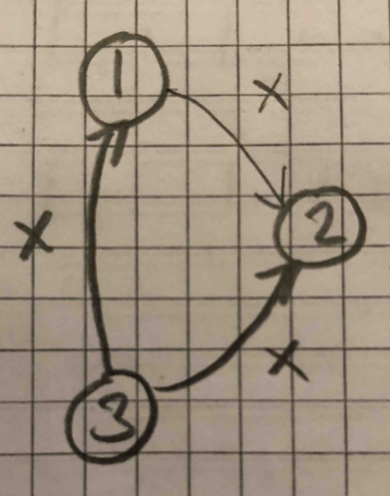

# Øving 5 - Adrian Leren

## Oppgave 1

### 1a)

SQL: _SELECT * FROM Eksamensregistrering;_

**Heapfil (1)** Siden vi uansett trenger alle postene som er lagret i tabellen er det enklest å hente alle blokkene fra heapfilen og så lese alt.

### 1b)

SQL: _SELECT * FROM Eksamensregistrering WHERE Eksamennr = 963432;_

**Clusterd statisk hash (4)** Da gjennomsnittlig treff på søk på 'Eksamennr' er 1.25 vil vi trenge å lese færrest blokker ved søk i denne strukturen.

### 1c)

SQL: _SELECT * FROM Eksamensregistrering WHERE Eksamennr = 963432 ORDER BY Studentnr DESC;_

**Clustered B+-tre med (Eksamennr, Studentnr) som søkenøkker (3)** Søk på Eksamennr i treet består av å kun traversere ned til blokkene som matcher søket. Å ordne etter Studentnr tilsvarer å traversere bortover på løvnivå. Det siste fungerer fordi poster lagres i rekkefølge basert på søkenøkkel.

### 1d)

SQL: _INSERT INTO Eksamensregistrering (14556589, 963439, '26.11.2018', "Øvingsopplegg bestått");_

**Heapfil (1)** Hvis vi antar at det ikke allerede finnes en post med samme primærnøkkel trengs det kun 2 operasjoner for å sette inn data i heapfil, 1 read og 1 write. Vi aksesserer kun 2 blokker.

## Oppgave 2

Bufferet holder 34 blokker. 32 av disse kan brukes til å holde blokker fra Student-tabellen som i alt er lagret i 800 blokker. For hver iterasjon leses alle 12 800 blokkene med data for Eksamensregistrering-tabellen.

Med nested-loop-join så leser vi tilsammen

*Blokker i ytre tabell (Student)* $+$ *Antall iterasjoner* $\cdot$ *Blokker i indre tabell* $=$ *Antall leste blokker*

$\Rightarrow 800 + \lceil\frac{800}{32}\rceil \cdot 12 800 = 320 800$ blokker.

## Oppgave 3

### 3a)

Transaksjoner støtter deling og samtidig aksess av data mellom flere brukere. De støtter også sikker, pålitelig, atomisk aksess til store mengder data. Derfor ønsker vi gjerne å ha transaksjoner.

### 3b)

Transaksjoner er en gruppering av operasjoner mot en database som har disse egenskapene:

* **A** - atomic: Operasjonen blir enten gjennomført i sin helhet, eller ikke i det hele tatt.
* **C** - consistency: Operasjonen overholder konsistenskrav.
* **I** - isolation: Operasjonene er isolerte fra og kjører uavhengig av hverandre.
* **D** - durability: Operasjonene er permanente.

### 3c)

H$_1$: w$_1$(X); r$_2$(X); w$_1$(X); w$_3$(Y); w$_2$(Y); c$_2$; c$_1$; c$_3$; **Unecoverable**

H$_2$: w$_1$(X); w$_3$(Y); w$_2$(Y); c$_1$; r$_2$(X); r$_3$(X); c$_2$; c$_3$; **ACA**

H$_3$: r$_3$(Y); w$_3$(Y); r$_1$(Y); w$_2$(X); c$_2$; w$_1$(X); c$_3$; c$_1$; **Recoverable**

### 3d)

To operasjoner fra en historie er i konflikt hvis:

1) de tilhører forskjellige transaksjoner.
2) de bruker samme dataelement.
3) minst en av operasjonene er en write.

Operasjonene er også i konflikt hvis endring av rekkefølgen på operasjonene endrer resultatet på databasen.

### 3e)

H$_4$: w$_3$(X); r$_1$(X); r$_2$(x); w$_2$(X); r$_3$(Y); c$_1$; c$_2$; c$_3$;

{ width=25% }

### 3f)

En vranglås oppstår når to eller flere transaksjoner venter på hverandre. Det kalles vranglås fordi vi i et slikt tilfelle har flere transaksjoner som er fastlåste og som ikke åpnes før transaksjonen de venter på åpnes. Men den andre transaksjonen åpnes først når den første transaksjonen åpnes... (evig løkke)

### 3g)

| T$_1$     | T$_2$     | T$_3$       |
|-----------|-----------|-------------|
|           |           | wl(X)       |
|           |           | w(X)        |
| try rl(X) |           |             |
|           | try rl(X) |             |
|           |           | rl(Y)       |
|           |           | r(Y)        |
|           |           | c, ul(X, Y) |
| rl(X)     | rl(X)     |             |
| r(X)      | r(X)      |             |
| c, ul(X)  |           |             |
|           | wl(X)     |             |
|           | w(X)      |             |
|           | c, ul(X)  |             |

## Oppgave 4

### 4a)

Transaksjon T$_2$ er vinner (rekker commit før krasj) og får REDO. T$_1$ og T$_3$ er tapere og
får UNDO.

### 4b)

#### Transaksjonstabell

| Transaksjon | Last_LSN    | Tilstand          |
|-------------|-------------|-------------------|
| T$_1$       | ~~148~~ 151 | active            |
| T$_2$       | ~~149~~ 150 | ~~active~~ commit |
| T$_3$       | 152         | active            |

#### DPT

| Page_ID | Recovery_LSN |
|---------|--------------|
| A       | 148          |
| B       | 152          |